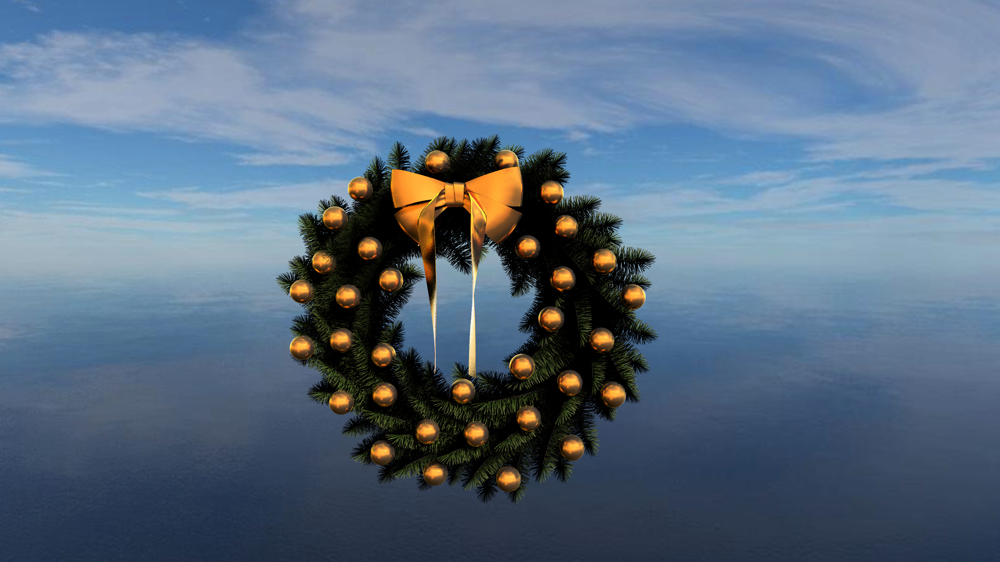
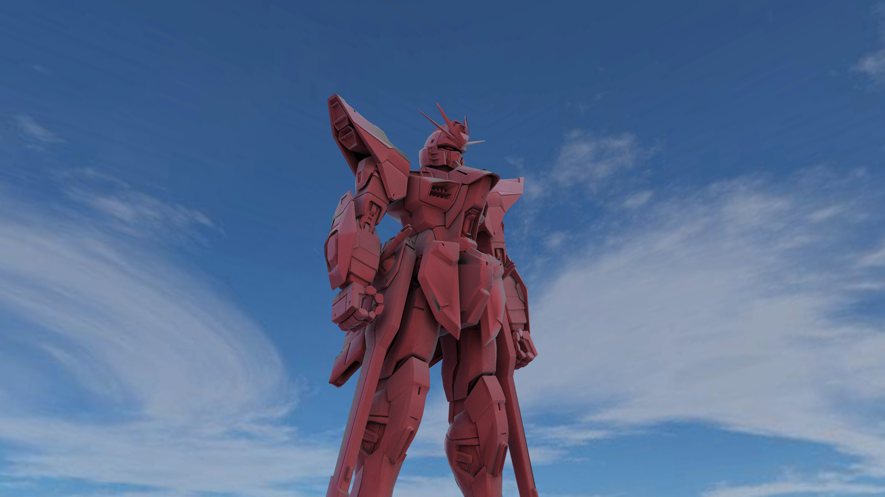
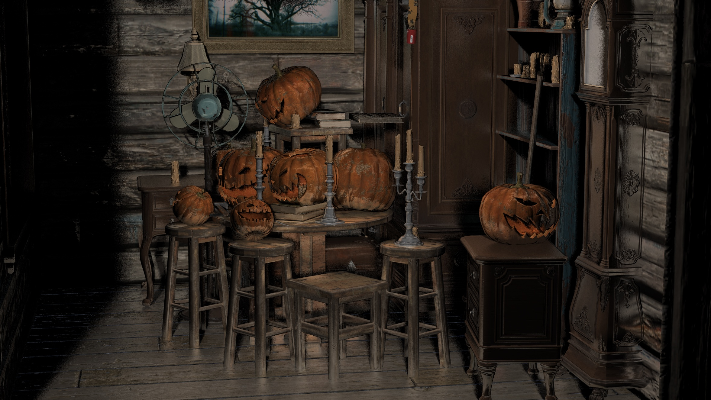
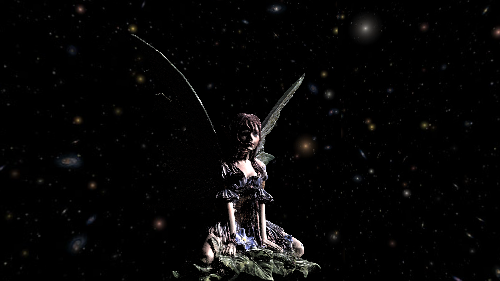

# 期末大作业项目报告(GraphicEngine)
小组成员
- 吴一墨（组长）
- 庞金靖
- 程孝轩
- 仲崇明
- 赵进喆
## 项目简介
项目借助OpenGL和ImGui，实现了一个简单的渲染引擎。拥有导入obj和gltf模型，简单的模型变换和材质编辑，一些基本的后处理效果。并且能够借助光追技术生成高质量图像。
## 项目结构
项目主要包含以下几个部分:

### OpenGL底层部分
---
#### 外部库
- `glew` - OpenGL加载库
- `glfw` - 窗口管理库
- `glm` - 数学库
- `opencv` - 图像加载库
- `tinyobjloader` - 模型加载库
- `tinygltf` - 模型加载库

#### 内部部分
- `Shader` - 着色器管理
- `ComputeShader` - 计算着色器管理
- `VertexArray` - 顶点数组管理
- `VertexBuffer` - 顶点缓冲区管理
- `IndexBuffer` - 索引缓冲区管理
- `VertexBufferLayout` - 顶点缓冲区布局管理
- `FrameBuffer` - 帧缓冲区管理
- `Texture` - 纹理
- `TextureArray` - 纹理数组

### 核心组件
---
- `Scene` - 场景
- `SceneNode` - 场景节点
- `Entity` - 实体
- `Component` - 组件
- `Mesh` - 网格
- `Material` - 材质
- `Light` - 光照
- `Camera` - 相机
- `Filter` - 滤镜
- `Skybox` - 天空盒
- `Particle` - 粒子系统

### 渲染组件
---
- `Renderer` - 渲染器
- `Quad` - 屏幕四边形
- `BVHTree` - BVH树
- `Octree` - 八叉树
- `AABB` - AABB包围盒

## 项目功能

### 模型加载
- 支持`obj`和`gltf`格式的模型加载与移除。
- 加载时保留原有的场景树结构不变。

### 模型渲染
- 可以预览材质和光照效果，也可以预览后处理效果。方便快速调节。
- 利用RayTracing实现高质量图像渲染。
- 利用BVH和八叉树进行加速。
- 利用TileQuad解决同步问题。

### 模型变换
- 实现模型缩放，旋转，平移。
### 材质编辑
- 可以对模型材质进行编辑，包括漫反射（diffuse），镜面反射（specular），粗糙度（roughness），金属度（metallic），自发光（emissive），和高光指数（shininess/SpecularExponent）。

### 光照系统
- 实现平行光，点光源，聚光灯。

### 后处理
- 实现FOD效果。
- 利用opencv实现亮度，饱和度，对比度和色相调节。同时准备了几个预设效果，有Invert，Gaussian Blur，Sepia,GreyScale和Sharpen。
### 粒子系统
-实现了简单的火焰的粒子系统。

## 项目实现
见演示视频，多余作品列在此处。
### 项目截图

  

